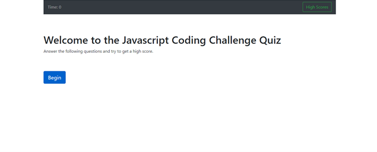

# js-testing-app

## Installation

This web app is made up of an Index.html file and a script.js file, which controls the quiz functionality.

The location is: https://christopher-cruzcosa.github.io/js-testing-app/ 

## Usage 

The user will initially see a main screen that allows them to either begin the quiz or see the existing high scores.

If they begin the quiz, the user will be asked five questions and will answer by clicking on the options.  A timer is running down from 100 seconds and each wrong answer deducts 10 seconds from the remaining total.  After the quiz, the remaining time in seconds is the user's score.  The user will see their score and then be asked to input their initials.  After submitting, a high scores screen will come up, which displays all previous scores/initials stored in local storage.  Once the user clicks "done", it will return them to the main screen.

If the user clicks to see high screens, from the main screen, a high scores screen will come up, which displays all previous scores/initials stored in local storage.  Once the user clicks "done", it will return them to the main screen.

## Credits

Created by: Christopher Cruzcosa

## License

Copyright (c) [2020] [Christopher Cruzcosa]

Permission is hereby granted, free of charge, to any person obtaining a copy
of this software and associated documentation files (the "Software"), to deal
in the Software without restriction, including without limitation the rights
to use, copy, modify, merge, publish, distribute, sublicense, and/or sell
copies of the Software, and to permit persons to whom the Software is
furnished to do so, subject to the following conditions:

The above copyright notice and this permission notice shall be included in all
copies or substantial portions of the Software.

THE SOFTWARE IS PROVIDED "AS IS", WITHOUT WARRANTY OF ANY KIND, EXPRESS OR
IMPLIED, INCLUDING BUT NOT LIMITED TO THE WARRANTIES OF MERCHANTABILITY,
FITNESS FOR A PARTICULAR PURPOSE AND NONINFRINGEMENT. IN NO EVENT SHALL THE
AUTHORS OR COPYRIGHT HOLDERS BE LIABLE FOR ANY CLAIM, DAMAGES OR OTHER
LIABILITY, WHETHER IN AN ACTION OF CONTRACT, TORT OR OTHERWISE, ARISING FROM,
OUT OF OR IN CONNECTION WITH THE SOFTWARE OR THE USE OR OTHER DEALINGS IN THE
SOFTWARE.

